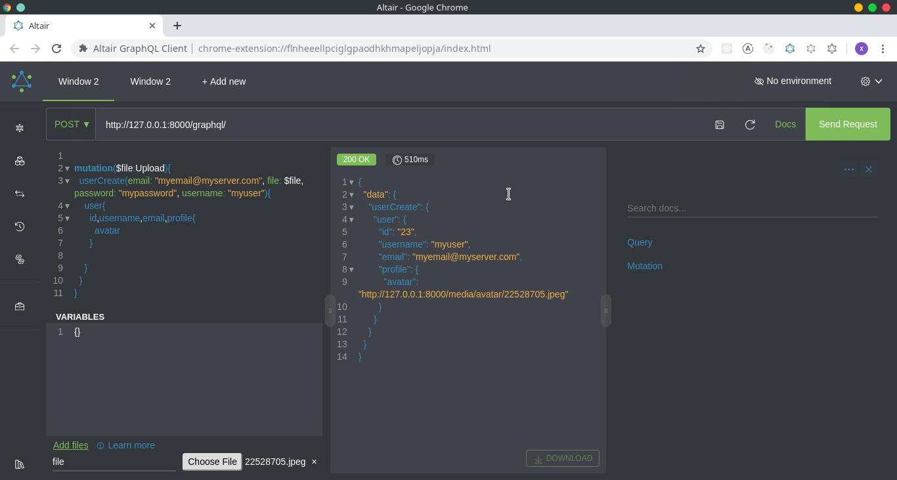
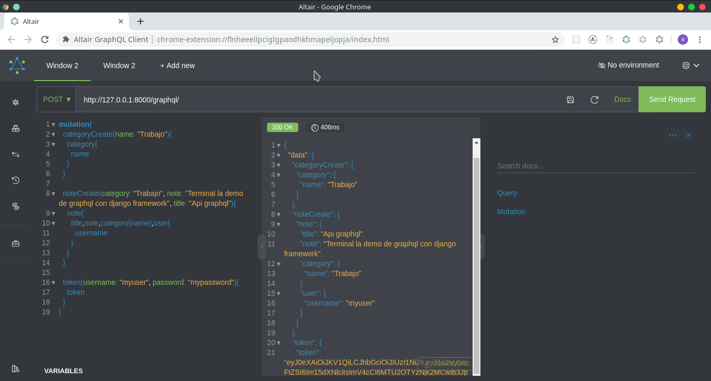
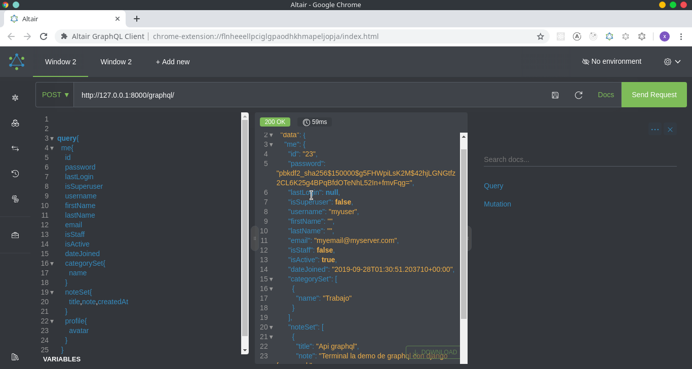

## My Notes

This is an example how to build an api [graphql]() with [django framework ](https://www.djangoproject.com/)for chanel of telegram [DjangoCuba](https://t.me/DjangoCuba), using [graphene](https://graphene-python.org), [graphene_django](https://docs.graphene-python.org/projects/django/en/latest/), [graphene_django_jwt](https://django-graphql-jwt.domake.io/en/stable/), [graphene_file_upload](https://github.com/lmcgartland/graphene-file-upload)

[Demo](http://xiron9090.pythonanywhere.com/graphql/)
### Required
- [Python](https://python.org)
- [pipenv](https://pipenv-fork.readthedocs.io/en/latest/)

### Api contains

- User authentication and user token
- Create note and categories
- Delete and update
- User profile
- Upload file

### Usage

```bash
git clone https://github.com/xiron9090/mynote.git
cd mynote
pipenv install
python manage.py makemigrations
python manage.py migrate
python manage.py createsuperuser
python manage.py run server
```
Open in your browser  http://127.0.0.1:8000/graphql/ or http://localhost:8000/graphql/
 
I recomend to use [Altair]() for test api,but can you [Postman]() or only use the terminal with command curl





For any question contact me :
- email: [xiron9090@gmail.com](xiron9090@gmail.com)
- telegram: [xiron9090](https://t.me/Xiron9090)

